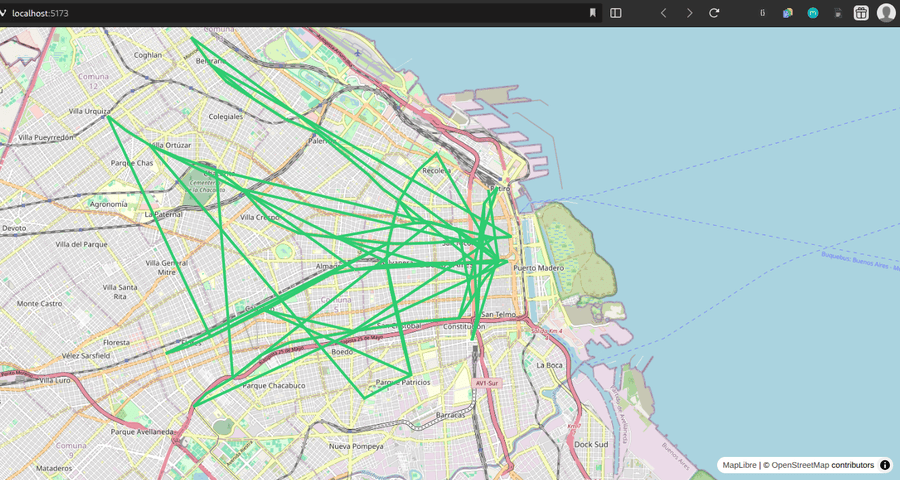
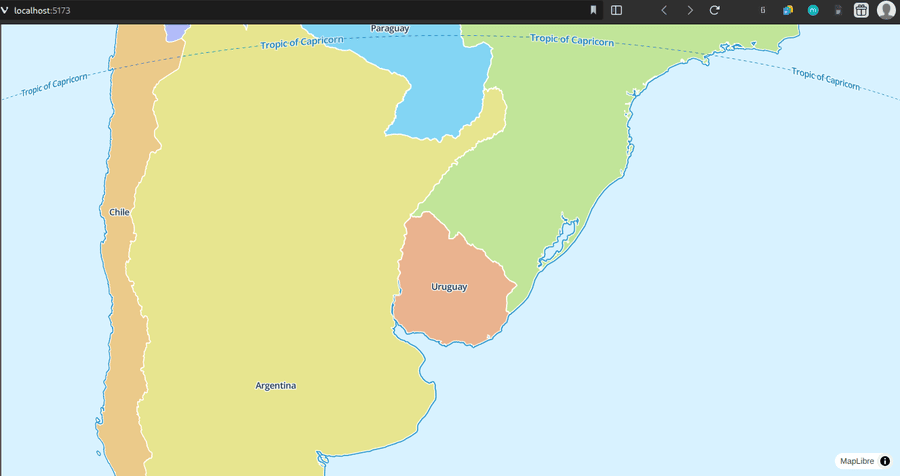
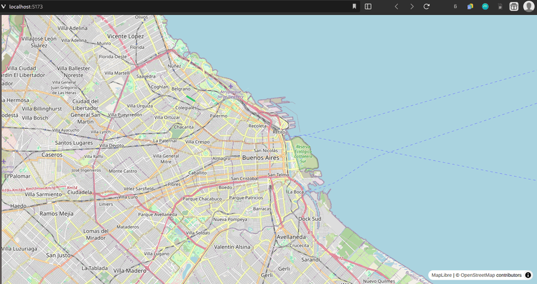

## Day 4: Rendering a real subway line from data

From CSV to GeoJSON (real data)

**Objective Pipeline**
>CSV → transformation → GeoJSON → MapLibre

### Naive geometry rendering (expected incorrect output)

Rendered a first-pass LineString generated from raw endpoint-only CSV data
(`lineas-de-subte-extract.csv`).

The resulting visualization shows erratic connections between stations
across different subway lines. This behavior is expected and confirms that:

- The CSV contains only endpoints, not full line geometries
- Segments are unordered and mixed across lines
- Naively flattening segments into a single LineString produces invalid topology

This step validates the full data → GeoJSON → MapLibre rendering pipeline
before introducing proper line filtering and geometry reconstruction.



This confirms that correct line rendering requires:
- Per-line filtering
- Ordered segment reconstruction
- Proper handling of MultiLineString geometries

Day 4 is considered complete.
The system now supports data-driven rendering from CSV-derived GeoJSON,
with known geometric inaccuracies that will be addressed in Day 5.

## Day 3 – Rendering the base map

Implemented a minimal MapLibre setup using Vite + TypeScript and validated the full browser rendering pipeline.

Successfully rendered a base map and a hardcoded GeoJSON representation of
Subway Line D, confirming correct map initialization, styling, and layer
configuration prior to real data integration.

**Pipeline validated**
>HTML → TS → MapLibre → GeoJSON → visual output


Key outcomes:
* MapLibre initialized via npm and bundled with Vite
* `main.ts` established as the single application entry point
* OpenStreetMap raster tiles rendered as the base map
* GeoJSON `LineString` rendered correctly as a line layer
* End-to-end browser rendering pipeline verified

Notes:
* GeoJSON data is currently hardcoded for validation purposes
* This step intentionally avoids dataset transformation
* External GeoJSON files will replace hardcoded data in Day 4

**Visual confirmation**





## Day 2 – Drawing one subway line

Initially attempted to load main.ts directly from HTML.
Learned that browsers do not execute TypeScript directly and that
a build/dev step is required when using npm-based MapLibre integration.

* MapLibre + GeoJSON + render
* Build with Vite (dev server) is deferred
* Dataset transformation is deferred (for simplicity)
* Reviewed https://maplibre.org/maplibre-gl-js/docs/
* Reviewed https://maplibre.org/maplibre-gl-js/docs/examples/add-a-geojson-line/

### Data relationships

Line endpoints correspond to subway stations by coordinate equality, not by shared IDs.
```ts
64,Jose Hernandez,D,POINT 
                 (`-58.45212`6677649765 `-34.566215`59971072)
                        v
MULTILINESTRING ((`-58.45212`56031295   `-34.566215`242404,
                   -58.4516295768312     -34.5664769668698,
                   -58.4490265638751     -34.5678793135606,
                  `-58.44466`81474258   `-34.570012`3091016));1;D
                        v
63,Olleros,D,POINT      v
                 (`-58.44466`9509559354 `-34.570012`54234762)
```

---

Outcome: line rendering deferred until build system is introduced.

## Day 1 – Understanding data and setting the model

### Dataset exploration:

* Stations: id, station, branch, geometry (POINTs)
* Lines: multiline(lat/lon), id, branch


Open questions: 
* How do stations and lines relate?
    * Semantically (by branch/line)
    * Spatially (by proximity - far more complex)
* Are IDs arbitrary?
* Do station and line IDs match? (they do not)
* Is this dataset sufficient, or is there an implicit pattern?

---

### Observations

* Stations and lines do not share IDs
* Stations appear to be grouped by branch
* MultiLineString geometries are ordered (no sorting required)

Stations use the following IDs ranges:
```
A 31-43, 70, 75-76, 82-83
B 20-30, 66, 72-74, 80-81
C 13-19, 57-58
D 6-12, 54-56, 62-65, 69, 71
E 44-53, 59-61, 67-68, 88-90
H 1-5, 77-79, 84-87
```

However, subway lines IDs do not match stations IDs (e.g. D line uses: 1-12, 42, 54, 61).

Hypotheses:
* Station IDs may encode historial creation order
* Terminal stations correspond to unpaired line endpoints

---

### Conceptual model

**Station**
* id
* name
* coordinates (lat/lon)
* lines[]

**Line**
* id
* name
* color
* geometry (MultiLineString)

Open modeling questions:
* What is a station, conceptually? → a geometry point
* Can a station belong to multiple lines?
* If so, how are transfers represented?
    * Exact point overlap?
    * Proximity-based grouping?
    * Derived polygons?

---

### Geometry understanding

* A MultiLineString represents a curve on the map
* It is composed of ordered LineStrings (sequences of POINTs)
* Points are already sequentially ordered in the dataset

Fields required for rendering:
* Geometry coordinates
* Line name / branch (for color grouping and tooltips)

---

### Hypotheses

* Station IDs may encode historical creation order
* Between stations of the same branch, line geometries form pairs:
  * The last coordinate of one segment matches the first of the next
* Stations without a matching pair correspond to terminal stations

From subway line geometries:
* Expected terminal count: 12 (6 start `<`, 6 end `>`)
* Observed terminal count: 14 → anomaly detected

```

MULTILINESTRING ((-58.3709684997244 -34.608810309661,-58.3742677265724 -34.6085590738884));60;A  --> TERMINAL <
MULTILINESTRING ((-58.4635405106623 -34.6290872274132,-58.4696396292697 -34.6307070870644));77;A --> TERMINAL >

MULTILINESTRING ((-58.3699298510178 -34.6029894969716,-58.3750715187716 -34.6032972862158));62;B --> TERMINAL <
MULTILINESTRING ((-58.4810135041216 -34.5777973778049,-58.4863853484926 -34.5743189142063));75;B --> TERMINAL >

MULTILINESTRING ((-58.3814344337621 -34.6276194522058,-58.3799211800979 -34.6219167333603));13;C --> TERMINAL <
MULTILINESTRING ((-58.3778190525875 -34.5950574057746,-58.374018216823 -34.5911938093721));14;C  --> TERMINAL >

MULTILINESTRING ((-58.3805743445213 -34.6042452037712,-58.373955806103 -34.6078023367265));12;D  --> TERMINAL >
MULTILINESTRING ((-58.4623784089614 -34.5556417667995,-58.4564891346516 -34.562309088005));61;D  --> TERMINAL <

MULTILINESTRING ((-58.3736842240469 -34.6092424297606,-58.3775808866363 -34.6128491070751));27;E --> TERMINAL <
MULTILINESTRING ((-58.4578917562798 -34.6401373534618,-58.4616517626562 -34.6433121637313));59;E --> TERMINAL >
MULTILINESTRING ((-58.3736872673035 -34.6092459040165,-58.376669883728 -34.5918660316281));82;E  --> TERMINAL <

MULTILINESTRING ((-58.4057948259686 -34.6384059882851,-58.4123851512005 -34.6412689433909));73;H --> TERMINAL >
MULTILINESTRING ((-58.4023761750349 -34.5945253962188,-58.3972155751019 -34.5874615464262));80;H --> TERMINAL >
MULTILINESTRING ((-58.397204875946 -34.5874851647961,-58.3915829658508 -34.5832453963252));81;H  --> TERMINAL <
```

Final hypothesis:
* Although in the real world subway stations overlap to allow transfers,
this dataset models each line independently, without shared station geometry.

Open question:
* How much additional structure can be inferred from these datasets alone?


---

### Data transformation

Should raw data transformation occur:
* at build time?
* at runtime?
* via a separate preprocessing script?

Proposed location:
* `scripts/transform.ts`

---

## Research

* What are web maps, tiles, and tile servers?
* OpenStreetMap resources:
  * https://wiki.openstreetmap.org/wiki/Browsing
  * https://wiki.openstreetmap.org/wiki/Raster_tile_providers

Generated a zoom-level GIF to understand tile behavior.


---

## Day 0 – Planning

* Reviewed datasets and available formats
* Decided to normalize data into GeoJSON for MapLibre compatibility
* Chose TypeScript for better structure and self-documentation (explicit data models and safer refactoring)
    
## Research

* Review MapLibre GL JS basic map initialization
* Understand how to add GeoJSON sources and layers
* Inspect subway datasets fields and relationships
* Decide GeoJSON structure for lines and stations